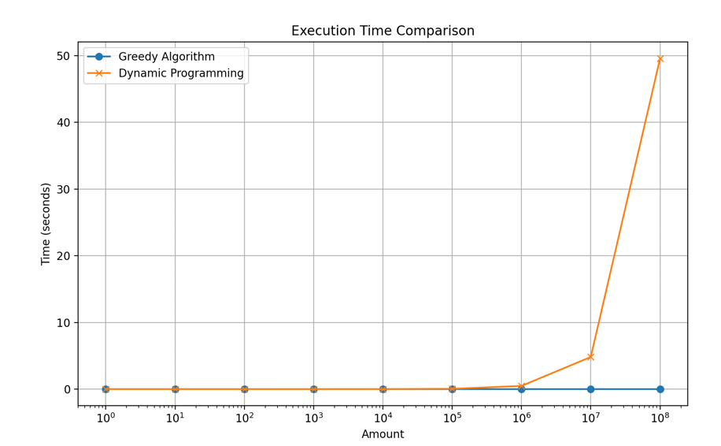
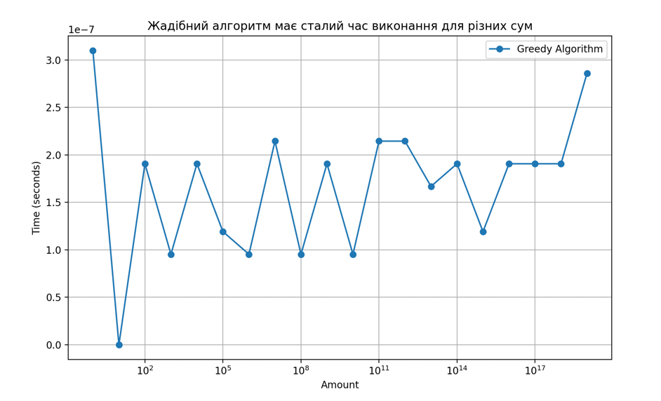
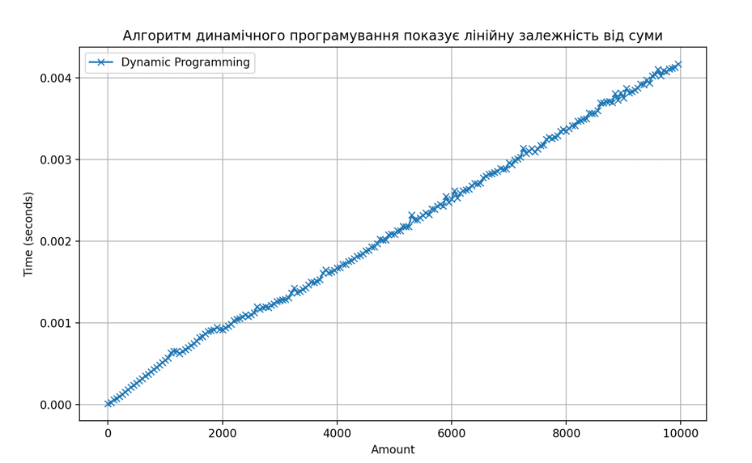

# Жадібний алгоритм проти динамічного програмування
Розглянули роботу двох підходів на задачі підбору монет для видачі решти,
де оптимізується кількість монет.

Функції видають однакові рішення. Проте підхід динамічного програмування
на великих сумах решти працює набагато довше. 

Часова складність жадібного алгоритму О(n) де n це кількість номіналів монет.
Тобто при фіксованій кількості, він має видавати константний час виконання О(1)
для різних сум. Підтверджуємо графіком:

Часова складність алгоритму динамічного програмування O(m×n), де m — сума,
яку потрібно видати, і n — кількість номіналів монет. При фіксованій кількості 
це все ще O(m), тобто час виконання зростає пропорційно сумі решти.

В умовах даної задачі з необмеженою кількістю монет кожного номіналу немає
сенсу відходити від жадібного алгоритму. За інших умов, наприклад обмеження
по кількості монет якихось номіналів чи інші додатковіумови, перевагою динамічного
програмування могло би бути гарантовано оптимальне рішення, тоді як жадібний
алгоритм знаходить тільки локальний оптимум. В випадку даної задачі це і є
найкраще рішення.
